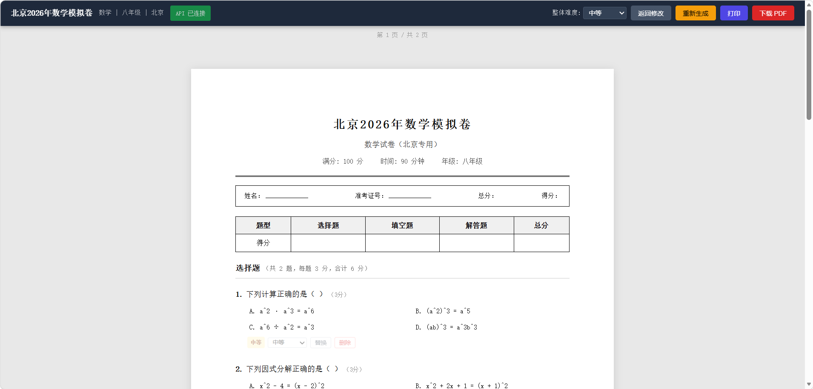
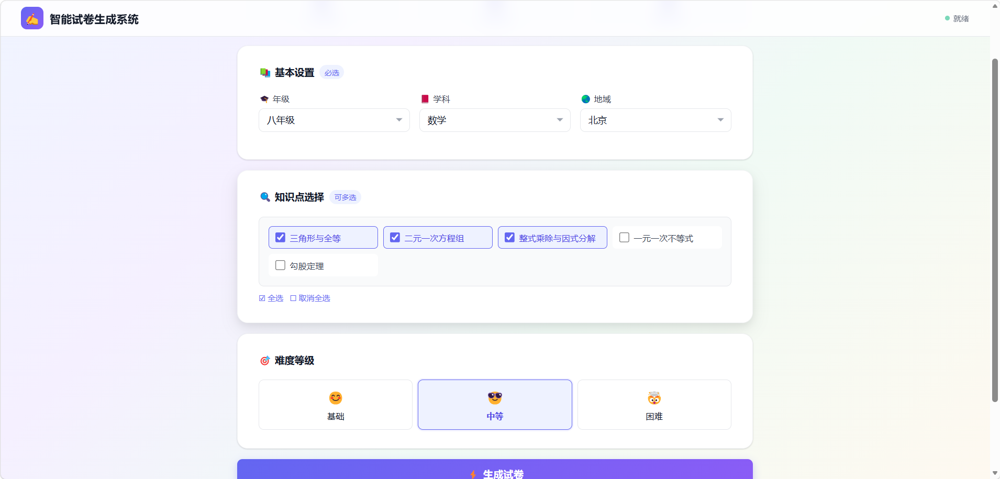

# 智能试卷生成系统（RAG + LLM）

一个基于**检索增强生成（RAG）+ 大语言模型（LLM）**的智能试卷生成与渲染系统。

系统面向教育场景，支持从知识库检索相关知识点，由 LLM 按照年级、学科、地区、知识点和难度等条件自动生成试题，并进一步生成完整试卷，支持 HTML / PDF 导出。

## 项目展示

### 智能试卷生成配置页面

系统提供可视化的试卷生成配置界面，可以选择年级、学科、地区、知识点以及试卷难度，并一键生成试卷。

<p align="center">
  
</p>

### AI 试卷生成与在线编辑页面

生成试卷后，系统提供在线预览、难度调整、题目替换、题目删除、重新生成、打印以及 PDF 下载等功能，方便教师对 AI 生成的试卷进行二次编辑和导出。

<p align="center">
  
</p>

---

## 主要功能

* **基于知识库的 RAG 检索**

  * 根据年级、学科、知识点等条件检索相关知识内容
  * 支持 ChromaDB 向量数据库
  * ChromaDB 不可用时自动回退到 In-memory 向量存储

* **LLM 智能出题**

  * 支持 Anthropic / OpenAI 兼容接口
  * 根据知识点和难度自动生成试题
  * 支持复杂试卷生成工作流

* **Orchestrator + Agent 工作流**

  * 通过编排器协调检索、生成、校验和渲染流程
  * 支持 Agent 模式
  * 支持失败重试与流程控制

* **异步任务处理**

  * 支持 Celery + Redis
  * 本地开发环境支持线程池执行
  * 适合耗时的批量试卷生成任务

* **试卷渲染与导出**

  * Jinja2 模板渲染 HTML
  * 支持 WeasyPrint 导出 PDF
  * 生成结果统一保存到 `output/`

* **在线试卷编辑**

  * 支持在线预览生成结果
  * 支持调整题目难度
  * 支持替换题目
  * 支持删除题目
  * 支持重新生成试卷
  * 支持打印和 PDF 下载

* **Docker 化部署**

  * 提供 Dockerfile
  * 提供 Docker Compose
  * 支持 Prometheus / Grafana 监控

---

## 系统工作流程

```text
用户配置试卷
    │
    ├── 年级
    ├── 学科
    ├── 地区
    ├── 知识点
    └── 难度
         │
         ▼
    RAG 知识检索
         │
         ▼
    LLM 智能生成
         │
         ▼
    试题校验 / 工作流编排
         │
         ▼
    试卷结构化数据
         │
         ▼
    HTML / PDF 渲染
         │
         ▼
    在线预览与编辑
         │
         ├── 调整难度
         ├── 替换题目
         ├── 删除题目
         └── 重新生成
         │
         ▼
    打印 / PDF 下载
```

## 技术栈

| 模块         | 技术                                |
| ---------- | --------------------------------- |
| 开发语言       | Python 3.11                       |
| Web 后端     | Flask                             |
| RAG / 向量检索 | ChromaDB / In-memory              |
| 大语言模型      | Anthropic / OpenAI Compatible API |
| 工作流        | Orchestrator + Agent              |
| 异步任务       | Celery / ThreadPool               |
| 消息队列       | Redis（可选）                         |
| 模板渲染       | Jinja2                            |
| PDF        | WeasyPrint（可选）                    |
| 容器化        | Docker / Docker Compose           |
| 监控         | Prometheus / Grafana              |

## 项目结构

```text
.
├── jiaoshi/
│   ├── backend/
│   │   ├── server.py              # 后端 API 入口
│   │   ├── rag_indexer.py         # 向量索引
│   │   ├── rag_searcher.py        # RAG 检索
│   │   ├── generate_paper.py      # 试卷生成
│   │   ├── render_paper.py        # HTML / PDF 渲染
│   │   ├── celery_app.py          # Celery 配置
│   │   └── async_tasks.py         # 异步任务
│   └── requirements.txt
│
├── frontend/
│   └── paper_renderer.html        # 前端试卷页面
│
├── docs/
│   ├──── project-preview-1.png  # 试卷生成配置页面
│   ├──── project-preview-2.png  # 试卷在线预览与编辑页面
│   ├── PROJECT_OVERVIEW.md
│   ├── API_REFERENCE.md
│   └── DEVELOPER_GUIDE.md
│
├── data/                          # 示例数据 / 知识库数据
├── output/                        # HTML / PDF 输出
└── README.md
```

## 快速开始

### 1. 创建虚拟环境

```bash
python -m venv .venv
```

Windows：

```powershell
.venv\Scripts\activate
```

Linux / macOS：

```bash
source .venv/bin/activate
```

### 2. 安装依赖

```bash
pip install -r jiaoshi/requirements.txt
```

### 3. 配置环境变量

在 `jiaoshi/` 下创建 `.env` 文件，配置 LLM API Key、模型地址以及其他运行参数。

示例：

```env
OPENAI_API_KEY=your_api_key
OPENAI_BASE_URL=https://api.openai.com/v1
MODEL_NAME=your-model
```

> 实际环境变量名称请以项目代码和 `docs/` 中的配置说明为准。

### 4. 启动后端

```bash
python jiaoshi/backend/server.py
```

启动后，可以通过浏览器访问前端页面：

```text
frontend/paper_renderer.html
```

生成的试卷通常可以在：

```text
output/
```

目录中查看。

---

## Docker 部署

进入 `jiaoshi` 目录：

```bash
cd jiaoshi
```

使用部署脚本：

```bash
./deploy.sh --docker
```

或者直接使用 Docker Compose：

```bash
docker compose up -d --build
```

查看运行状态：

```bash
docker compose ps
```

停止服务：

```bash
docker compose down
```

### 监控

如果项目配置了 Prometheus / Grafana，可以使用：

```bash
docker compose -f docker-compose.monitoring.yml up -d
```

用于查看系统运行状态、任务执行情况以及相关监控指标。

---

## API 与核心模块

### 后端入口

```text
jiaoshi/backend/server.py
```

负责：

* HTTP API
* 试卷生成请求
* 任务调度
* 结果返回

### RAG 检索

```text
jiaoshi/backend/rag_indexer.py
jiaoshi/backend/rag_searcher.py
```

负责：

* 文档切分
* 向量化
* 向量索引
* 相似度检索
* 知识点召回

### 试卷生成

```text
jiaoshi/backend/generate_paper.py
```

负责：

* 根据用户条件生成试题
* 组织题型与知识点
* 控制试卷难度
* 生成结构化试卷数据

### 试卷渲染

```text
jiaoshi/backend/render_paper.py
```

负责：

* Jinja2 HTML 模板渲染
* HTML 试卷生成
* PDF 导出

### 异步任务

```text
jiaoshi/backend/celery_app.py
jiaoshi/backend/async_tasks.py
```

分别支持：

* Celery + Redis
* 本地线程池

---

## RAG + LLM 核心架构

本项目采用 RAG 与 LLM 结合的方式生成试卷。

```text
知识库
  │
  ▼
文档切分
  │
  ▼
Embedding
  │
  ▼
向量数据库
  │
  ▼
用户试卷配置
  │
  ▼
相似知识检索
  │
  ▼
Prompt 构建
  │
  ▼
LLM
  │
  ▼
结构化试题
  │
  ▼
试卷校验
  │
  ▼
HTML / PDF
```

相比单纯依赖 LLM 直接生成试题，RAG 可以让模型优先参考指定知识库内容，从而提升生成内容与教学知识点之间的相关性。

---

## 开发注意事项

### API Key

不要将 API Key、数据库密码等敏感信息直接提交到 Git 仓库。

推荐通过：

* `.env`
* Docker Secrets
* 云平台密钥管理服务
* CI/CD Secret

等方式注入。

### ChromaDB

系统优先使用 ChromaDB 进行向量存储。

如果 ChromaDB 不可用，系统会自动回退到 In-memory 实现，但重启后内存索引可能丢失，同时语义检索能力和持久化能力可能受到影响。

### Celery

如果使用 Celery，需要确保 Redis 或其他 Broker 正常运行，并正确配置相关环境变量。

---

## 文档

项目相关文档：

* `docs/PROJECT_OVERVIEW.md`：项目概览与系统架构
* `docs/API_REFERENCE.md`：API 参考
* `docs/DEVELOPER_GUIDE.md`：开发者指南

---

## 贡献

欢迎提交 Issue 和 Pull Request。

在提交代码前建议：

1. 明确说明修改目的
2. 尽量提供可复现的测试步骤
3. 不提交 API Key、密码等敏感信息
4. 对核心功能补充必要的测试

---

## License

请在项目根目录补充 `LICENSE` 文件，并根据项目实际授权方式选择合适的开源许可证。

---

## 项目定位

**智能试卷生成系统 = 知识库 + RAG + LLM + 工作流 + 自动渲染**

目标是将传统的人工组卷流程自动化，让教师可以通过简单的配置快速生成符合指定年级、学科、知识点和难度要求的试卷。
