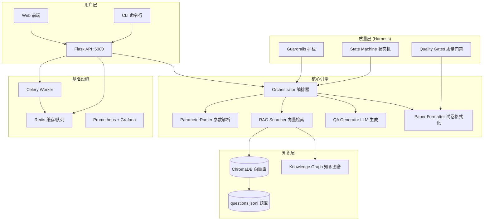

# 智能试卷生成系统

> 基于 RAG + LLM 的 K12 智能组卷平台，支持北京/上海/广东三地域差异化出卷。

---

## 1. 系统概述

智能试卷生成系统是一个面向 K12 教育的 AI 组卷平台，融合向量检索（RAG）和大语言模型生成能力，为教师和教研员提供高质量、可定制的试卷生成服务。

**核心能力**：
- 支持 9 大学科（数学/语文/英语/物理/化学/生物/历史/地理/政治）
- 覆盖小学 1 年级至高中 3 年级
- 北京/上海/广东三地域差异化试卷风格
- RAG 检索 + LLM 生成双引擎出题
- 完整 Harness Engineering 质量保障体系

---

## 2. 系统架构



### 技术栈

| 层级 | 技术 |
|------|------|
| API 框架 | Flask + Celery |
| 向量数据库 | ChromaDB (HNSW 索引) |
| 嵌入模型 | SentenceTransformer (paraphrase-multilingual-MiniLM-L12-v2) |
| LLM | Claude API / OpenAI API / 本地模型 |
| 缓存 | Redis (L1) + 内存 TTLCache (L2) |
| 监控 | Prometheus + Grafana |
| 部署 | Docker Compose (多服务编排) |

---

## 3. 快速开始（5 分钟部署）

### 前置条件

- Python 3.11+
- Docker & Docker Compose（可选）
- LLM API Key（Anthropic 或 OpenAI）

### 方式一：Docker 部署（推荐）

```bash
# 1. 配置 API Key
cp backend/.env.example backend/.env
# 编辑 backend/.env，填入 ANTHROPIC_API_KEY

# 2. 一键部署
bash scripts/deploy.sh --prod

# 3. 验证
curl http://localhost:5000/api/health
```

### 方式二：本地开发

```bash
# 1. 安装依赖
pip install -r requirements.txt

# 2. 构建测试数据
python scripts/build_mock_training_data.py

# 3. 构建向量索引
python -c "from backend.rag_indexer import build_index; build_index(force_rebuild=True)"

# 4. 启动服务
python backend/server.py
```

### 生成第一份试卷

```bash
# CLI 方式
python backend/orchestrator.py \
    --subject math --grade 初三 --region beijing \
    --points "一元二次方程,二次函数" --count 10

# API 方式
curl -X POST http://localhost:5000/api/generate_paper \
  -H "Content-Type: application/json" \
  -d '{"subject":"math","grade":"grade_9","region":"beijing",
       "knowledge_points":["一元二次方程"],"num_questions":5}'
```

---

## 4. 核心模块

```
jiaoshi/
├── backend/
│   ├── server.py                  # Flask API 服务
│   ├── orchestrator.py            # 总控编排器（Harness 状态机）
│   ├── rag_searcher.py            # RAG 检索（向量相似度 + 地域过滤）
│   ├── rag_indexer.py             # 向量索引构建
│   ├── celery_app.py              # Celery 异步任务队列
│   ├── multi_cache.py             # Redis + 内存 多级缓存
│   │
│   ├── agents/                    # Sub-Agent（Harness 角色）
│   │   ├── parameter_parser_agent.py   # 参数解析
│   │   ├── question_retriever_agent.py # 题目检索
│   │   ├── qa_generator_agent.py       # LLM 生成
│   │   └── paper_formatter_agent.py    # 试卷格式化
│   │
│   ├── knowledge/                 # 知识库管理
│   │   ├── vector_store.py        # 向量存储 CRUD + 版本管理
│   │   ├── regional_filter.py     # 地域过滤 + fallback
│   │   └── knowledge_graph.py     # 知识点图谱查询
│   │
│   ├── paper_styles/              # 地域样式
│   │   ├── style_registry.py      # 样式配置中心
│   │   ├── templates/             # HTML 模板 (beijing/shanghai/guangdong)
│   │   └── content_adapters/      # 内容适配器
│   │
│   ├── orchestration/             # 编排引擎
│   │   └── state_machine.py       # 状态机 + 迁移日志
│   │
│   ├── guardrails/                # 护栏系统
│   │   ├── rules.yaml             # 10 条护栏规则
│   │   └── guardrail_checker.py   # 前置/后置校验
│   │
│   └── tracing/                   # LangSmith 追踪
│       ├── tracer.py              # 装饰器 + 本地回退
│       └── eval_tracker.py        # 评估结果上报
│
├── harness/                       # Harness 工程规范
│   ├── AGENTS.md                  # Agent 角色定义
│   ├── RULES.md                   # 护栏规则
│   ├── SPECS.md                   # 数据契约
│   ├── WORKFLOW.md                # 状态机流程
│   ├── SKILLS.md                  # Skill 模板
│   └── QUALITY_GATES.md           # 质量门禁标准
│
├── tests/                         # 测试套件
│   ├── conftest.py                # 30+ fixtures
│   ├── integration/               # 端到端集成测试
│   ├── validators/                # Schema + 重复检测
│   └── rag_evaluation/            # Ragas 评估
│
├── scripts/                       # 运维脚本
│   ├── deploy.sh                  # 一键部署
│   ├── warmup_cache.py            # 缓存预热
│   └── show_state.py              # 状态机仪表盘
│
├── docs/                          # 文档
├── Dockerfile.production          # 生产镜像
├── docker-compose.yml             # 服务编排
└── docker-compose.monitoring.yml  # 监控栈
```

---

## 5. 质量保障体系

系统实现了完整的 Harness Engineering 四重约束：

| 约束 | 实现 | 文件 |
|------|------|------|
| **角色边界** | 7 个 Agent，每个只做一件事 | `harness/AGENTS.md` |
| **状态机** | 8 状态 × 11 事件 = 24 条迁移规则 | `backend/orchestration/state_machine.py` |
| **产物契约** | 4 份 JSON Schema 契约 | `harness/SPECS.md` |
| **护栏规则** | 10 条 BLOCKER/WARNING 规则 | `backend/guardrails/rules.yaml` |

**6 道质量门禁**：
```
Gate 0 (数据就绪) → Gate 1 (完整性) → Gate 2 (合规) → Gate 3 (检索质量) → Gate 4 (生成质量) → Gate 5 (地域适配)
```

---

## 6. 链接

| 文档 | 说明 |
|------|------|
| [USER_GUIDE.md](USER_GUIDE.md) | 用户使用手册 |
| [API_REFERENCE.md](API_REFERENCE.md) | API 接口文档 |
| [DEVELOPER_GUIDE.md](DEVELOPER_GUIDE.md) | 开发者指南 |

| 规范 | 说明 |
|------|------|
| [AGENTS.md](../harness/AGENTS.md) | Agent 角色边界定义 |
| [RULES.md](../harness/RULES.md) | 开发约束与护栏 |
| [SPECS.md](../harness/SPECS.md) | 数据契约 |
| [WORKFLOW.md](../harness/WORKFLOW.md) | 状态机流程 |
| [QUALITY_GATES.md](../harness/QUALITY_GATES.md) | 质量门禁标准 |

---

## 7. 许可证

本项目仅供教育和研究用途。
